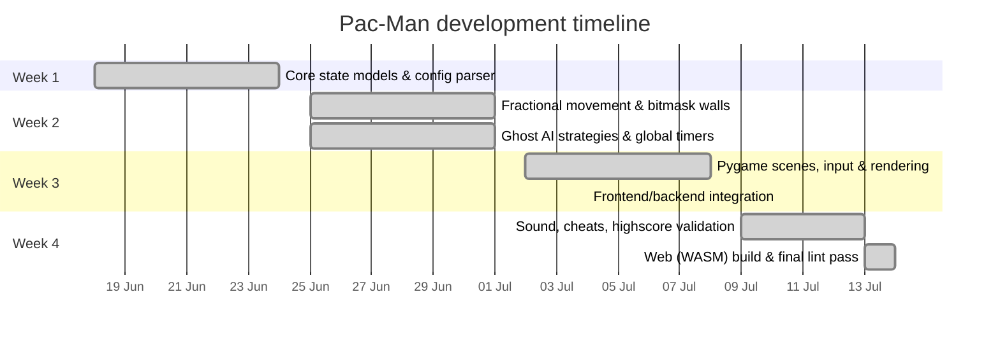

## Project Timeline vs. Actual Progress

The project ran for roughly four weeks (2026-06-18 → 2026-07-14), tracked directly against the git history below rather than an external tool.

| Milestone / Feature | Estimated Completion | Actual Completion | Notes / Deviations |
| :--- | :--- | :--- | :--- |
| Core State Models & Config Parser | Week 1 | Week 1 (Jun 18–24) | Smooth setup using dataclasses (`GameState`, `Pacman`, `Ghost`); initial pygame scaffolding, controller and renderer skeleton in place by Jun 19. |
| Fractional Movement & Bitmask Walls | Week 2 | Week 3 (delayed to Jun 26) | Delayed ~4 days by a ghost flip-flop/oscillation bug at wall junctions; fixed 2026-06-26 by blocking immediate direction reversal and correcting edible/chasing state handling. |
| Ghost AI Strategies & Global Timers | Week 3 | Week 2–3 (Jun 25–26) | `PseudoRandomMovement` and the shared edibility/respawn timers landed alongside the movement fix. |
| Pygame Scenes, Input & Rendering | Week 4 | Week 2–3 (Jun 27–Jul 8) | Main menu, pause, instructions, highscores and final scenes, plus the `AnimationManager`, were built incrementally; frontend and backend work streams were combined on 2026-07-04 (see [BLOCKING_POINTS.md](BLOCKING_POINTS.md)). |
| Config-driven Gameplay, Highscores & Cheats | — | Week 2–4 (Jul 1–13) | Config file parsing, the score board (with alphanumeric name validation), and the four debug cheats (invincibility, skip level, extra life, freeze ghosts) were added and hardened over the second half of the project. |
| Audio Integration | — | Week 4 (Jul 10–12) | Background music, munch/death/ghost sound effects wired into `GameScene`; landed alongside a package restructure ("make sub modules") that briefly introduced regressions before being stabilized. |
| Web (WASM) Build | — | Week 4 (Jul 14) | `pygbag` export produced and committed to `build/`; `config.txt` was renamed to `config.json` on the same day, one day before the final deadline. |

Overall, the plan held for roughly 60% of milestones; the two biggest deviations — the ghost-movement bug and the large mid-project frontend/backend merges — are detailed in [RISK_ANALYSIS.md](RISK_ANALYSIS.md) and [BLOCKING_POINTS.md](BLOCKING_POINTS.md).
